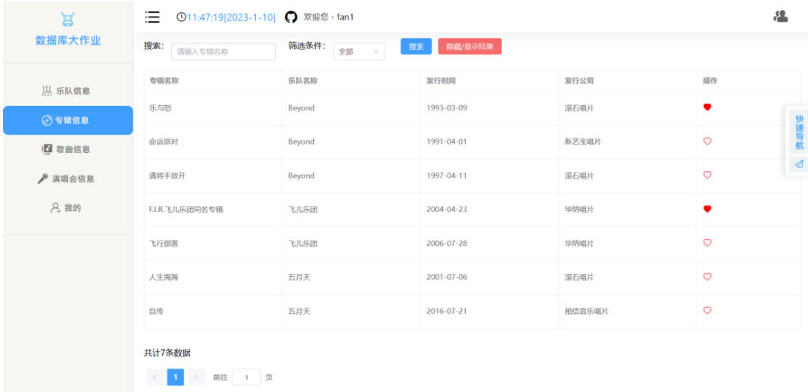
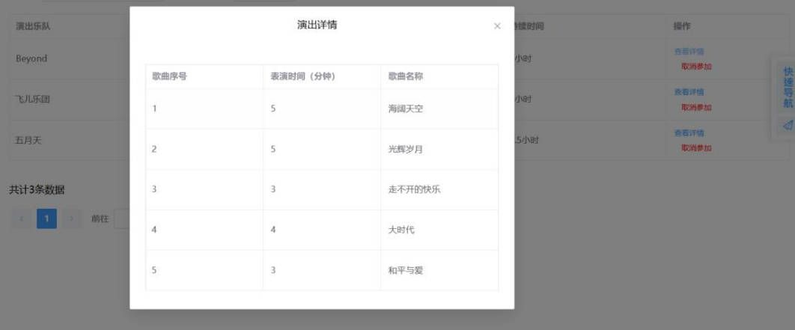
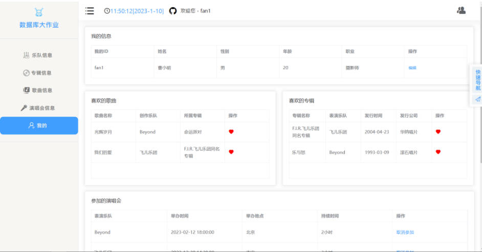
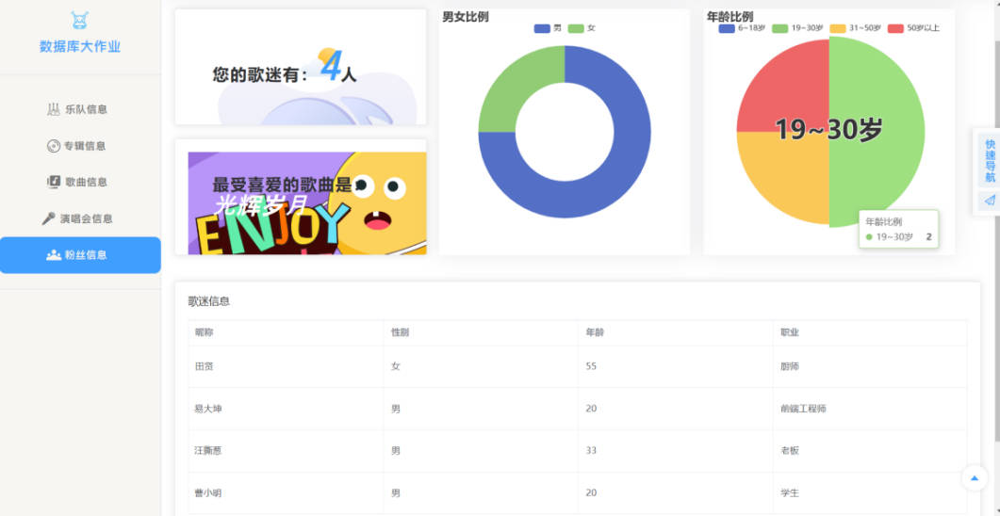

# 数据库大作业
乐队管理系统
## 安装说明

### 前置依赖安装

在执行后续步骤之前，请确保您安装了如下依赖库：

- MySQL >= 8.0
- Node.js >= 16.0
- Python >= 3.8


### 项目下载与安装

上述依赖安装完毕后，首先从GitHub将项目克隆到本地：

```shell
git clone --recursive https://github.com/terayco/database_finalwork.git
```

在后端目录下运行如下命令以安装Web后端的所有依赖：

```shell
pip install -r ./requirements.txt
```


在前端运行如下命令安装Web前端的所有依赖：

```shell
npm install
```
然后执行以下指令开启前端服务
```shell
npm run serve
```
注：请在启动后端服务前将后端文件中passwrd.py中的密码改为本地root密码

## 部分效果展示图
 <p align="center">
    
  </p>
  
  <p align="center">
    
  </p>
  
  <p align="center">
    
  </p>
  
  <p align="center">
    
  </p>
  
  <p align="center">
    
  </p>
